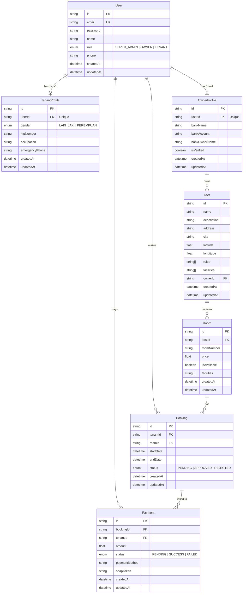
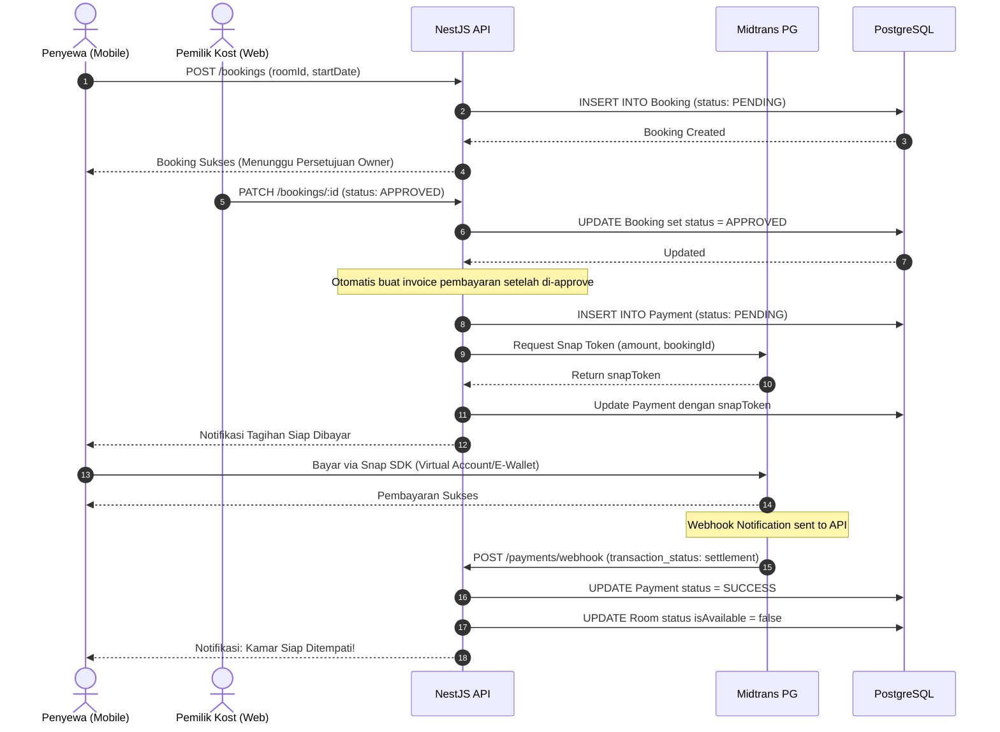

# Kostify - System Design & Architecture

Dokumentasi ini menjelaskan secara mendalam tentang perancangan sistem, arsitektur basis data (ERD), alur proses (Sequence Diagram), dan endpoint API pada ekosistem **Kostify**.

## 📊 Entity Relationship Diagram (ERD)

Berikut adalah struktur basis data relasional PostgreSQL yang dirancang menggunakan model relasi 1-to-1 untuk pemisahan data profil pengguna agar database tetap optimal dan bersih.

---

## 🔄 Sequence Diagrams

### 1. Alur Registrasi Akun & Pembuatan Profil
Menjelaskan bagaimana pengguna mendaftar ke sistem, divalidasi oleh backend, dan profil khusus dibuat berdasarkan role mereka (Owner/Tenant).

```mermaid
sequenceDiagram
    autonumber
    actor Client as User/Client
    participant API as NestJS API
    participant DB as PostgreSQL (via Prisma)

    Client->>API: POST /auth/register (name, email, password, role)
    Note over API: Validasi format data & enkripsi password (bcrypt)
    
    API->>DB: Cek ketersediaan Email
    DB-->>API: Email Belum Terdaftar
    
    API->>DB: Simpan data User baru
    DB-->>API: User Berhasil Disimpan
    
    rect rgb(30, 41, 59)
        Note over API: Jika role = OWNER, buat profil kosong di OwnerProfile
        API->>DB: INSERT INTO OwnerProfile (userId)
        DB-->>API: OwnerProfile Created
    end
    
    API->>API: Generate JWT Token (payload: userId, email, role)
    API-->>Client: HTTP 201 (access_token, user_data)
```

### 2. Alur Transaksi Pemesanan Kamar (Booking & Payment)
Menjelaskan proses penyewa melakukan booking kamar hingga pembayaran berhasil diproses menggunakan Payment Gateway (Midtrans).

---

## 🛠️ Dokumentasi API Utama (Endpoints)

### **Autentikasi (`/auth`)**
- `POST /auth/register`: Mendaftarkan akun user baru (Role default: `TENANT`).
- `POST /auth/login`: Autentikasi user & generate JWT Token.
- `GET /auth/me`: Mengambil data profil user saat ini (Membutuhkan Header Bearer Token).

### **Kost & Kamar (`/kosts`, `/rooms`)**
- `GET /kosts`: Mencari dan memfilter kost (Mobile/Web).
- `POST /kosts`: Membuat properti kost baru (Khusus Owner).
- `GET /kosts/:id`: Melihat detail unit kost beserta daftar kamarnya.
- `POST /rooms`: Menambahkan kamar baru ke dalam kost (Khusus Owner).

### **Transaksi (`/bookings`, `/payments`)**
- `POST /bookings`: Mengajukan sewa kamar kost (Khusus Tenant).
- `GET /bookings/owner`: Melihat daftar pengajuan sewa masuk (Khusus Owner).
- `PATCH /bookings/:id`: Menyetujui/menolak pengajuan sewa (Khusus Owner).
- `POST /payments/webhook`: Menerima callback status pembayaran dari Midtrans.
